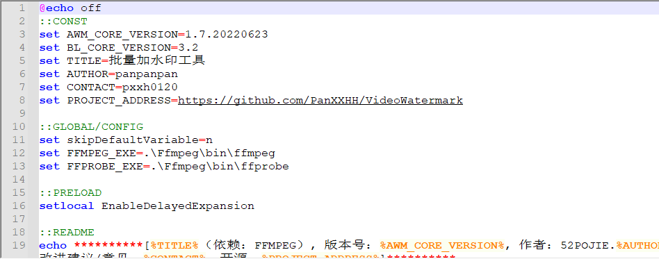
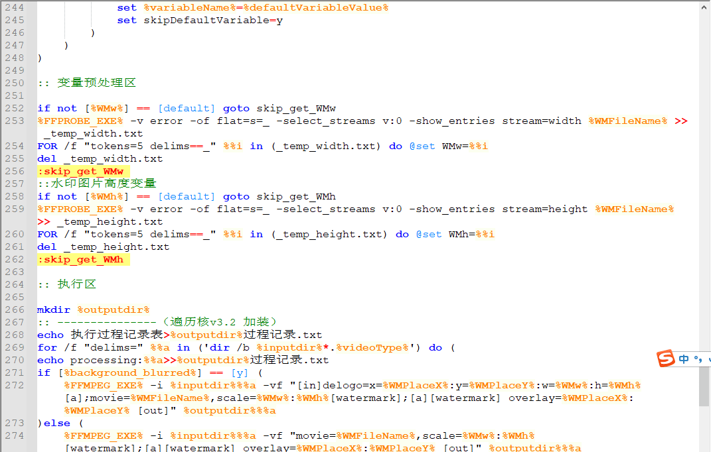
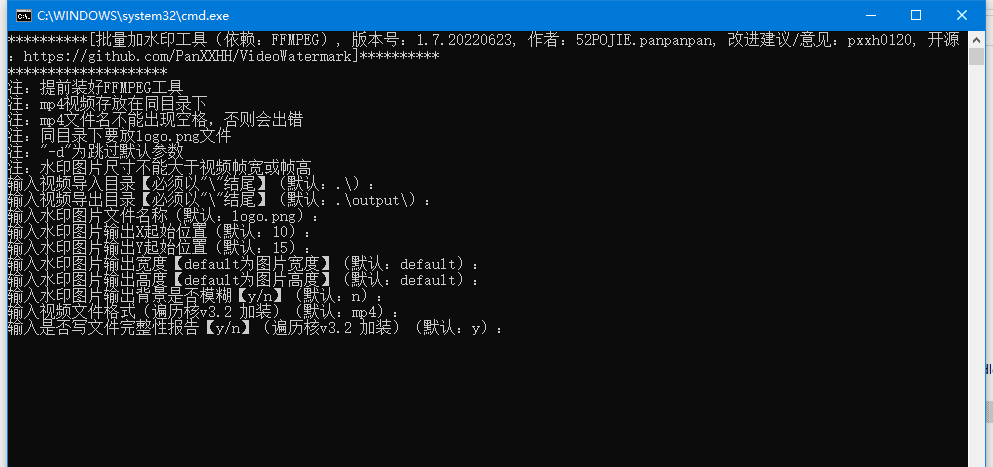
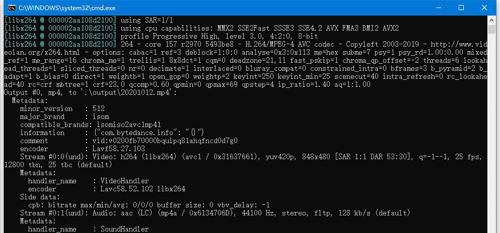

# 批量加水印工具（依赖：FFMPEG）
___
***[版本号：1.7.20220623, 作者：panpanpan, 改进建议/意见：pxxh0120]***
___
- 提前装好FFMPEG工具
- mp4视频存放在同目录下
- mp4文件名不能出现空格，否则会出错
- 同目录下要放logo.png文件
- "-d"为跳过默认参数
- 水印图片尺寸不能大于视频帧宽或帧高

___

