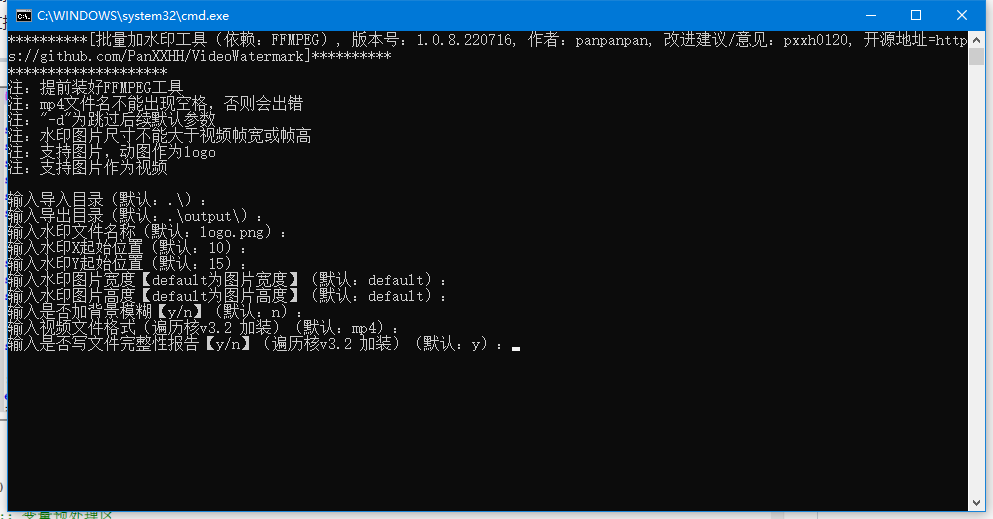

# 批量加水印工具（依赖：FFMPEG）
___
***[版本号：1.0.8.220716, 作者：panpanpan, 改进建议/意见：pxxh0120]***
___
Update logs:

	1.0.8.220716
		1. 修复带空格文件名文件报错问题
		2. 新增配置config.ini文件
		3. 优化代码
___
- 提前装好FFMPEG工具
- mp4文件名不能出现空格，否则会出错
- "-d"为跳过后续默认参数
- 水印图片尺寸不能大于视频帧宽或帧高
- 支持图片，动图作为logo
- 支持图片作为视频
___

